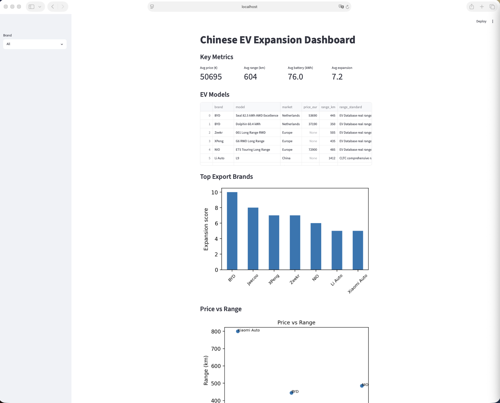
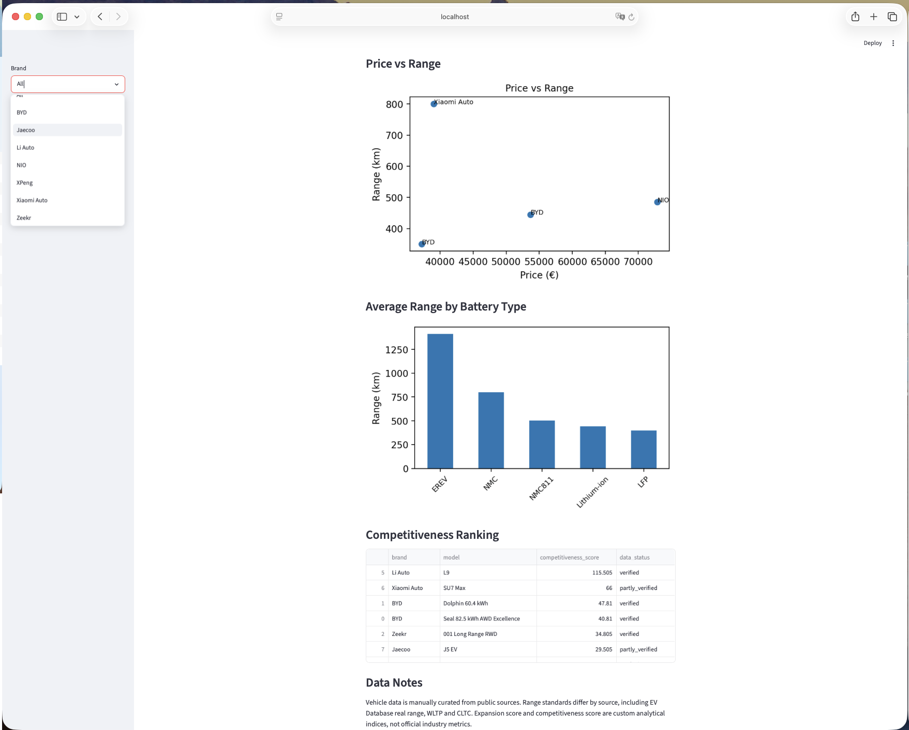

# Chinese EV Expansion Dashboard

## Overview

This project is an interactive competitive intelligence dashboard focused on Chinese electric vehicle manufacturers and their international expansion.

The dashboard combines vehicle specifications, battery technologies and market expansion data to compare brands and evaluate their competitive position.

Brands included:

- BYD
- NIO
- Zeekr
- XPeng
- Li Auto
- Xiaomi Auto
- Jaecoo

---

## Objectives

- Analyze Chinese EV brands and models
- Compare price and driving range
- Evaluate battery technologies
- Assess international expansion potential
- Build custom competitiveness indicators

---

## Technologies Used

- Python
- Pandas
- Streamlit
- Matplotlib

---

## Features

### Interactive brand filtering

Users can select individual brands through the sidebar.

### Key metrics

The dashboard displays:

- Average price
- Average range
- Average battery capacity
- Average expansion score

### EV model database

Vehicle specifications include:

- Price
- Range
- Battery type
- Market
- Data quality status

### Expansion analysis

Ranking of brands based on international expansion.

### Competitiveness ranking

Custom score based on:

- Driving range
- Expansion score
- Vehicle price

---

## Screenshots

### Dashboard Overview

### Interactive Analysis

---

## Data Sources

Data is manually curated from public sources including:

- EV Database
- Manufacturer websites
- Public specifications
- Industry reports

---

## Author

Oliver de Bruin

Bachelor International Business Administration

Focus areas:

- Business Intelligence
- Data Analytics
- AI
- Chinese Automotive Industry